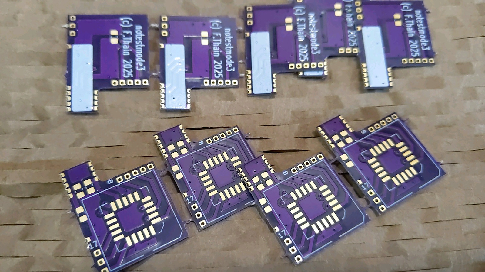
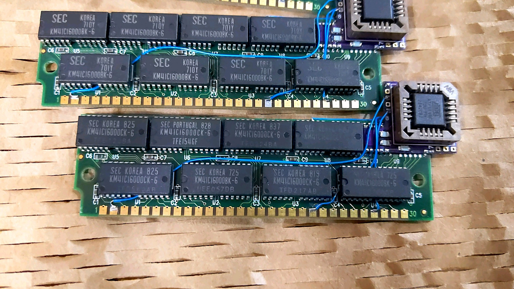
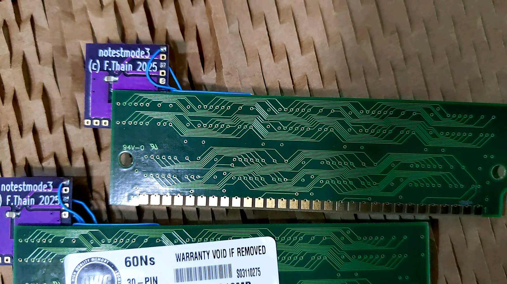
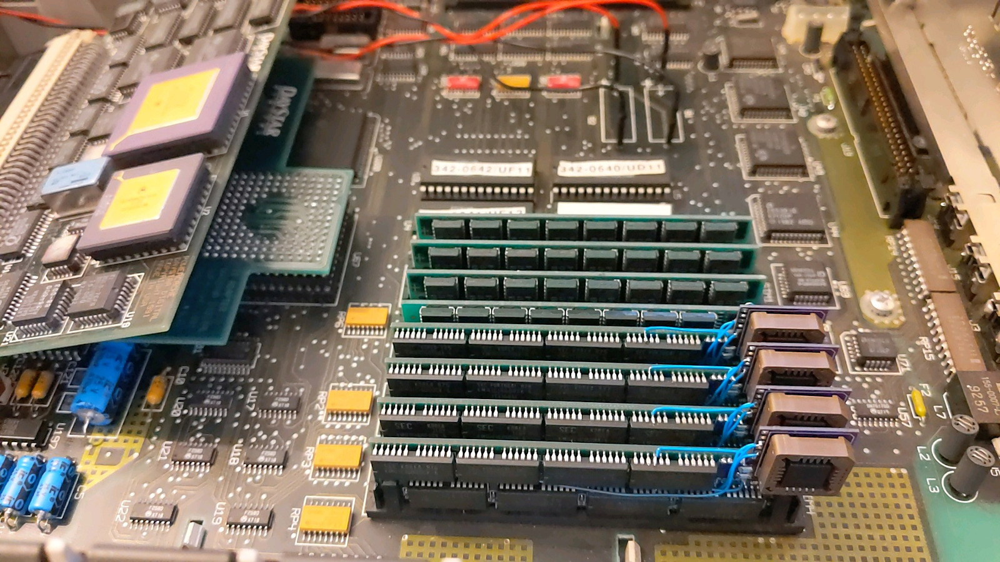

## notestmode - PCB and PLD designs

(c) Finn Thain 2024-2025

This project is a test rig for a logic circuit which provides backward compatibility to 4 Mbit and 16 Mbit DRAM devices, so they can be used in systems like the [Macintosh II](https://en.wikipedia.org/wiki/Macintosh_II) which pre-date the relevant DRAM standards.

A detailed discussion of the compatibility issue can be found in [Apple Technical Note #176: Macintosh Memory Configurations](https://www.tech-insider.org/mac/research/acrobat/9204.pdf). In short, DRAM chips larger than 1 Mbit end up in test mode and the system fails its POST.

Over the years, engineers have found various solutions to this problem. The design published here takes the traditional approach that adds a programmable logic device (PLD or PAL) to each SIMM.

The PLD chip intercepts the /RAS, /CAS and /WE signals sent from the logic board and generates a gated, albeit delayed, /WE signal as well as /RAS and /CAS signals which are similarly delayed.

## Other solutions

- A SIMM design for 4 Mbit devices complete with schematics and gerbers is available at [https://github.com/garrettsworkshop/RAMSIMM-30](https://github.com/garrettsworkshop/RAMSIMM-30).
- Another SIMM design for 4 Mbit devices is available at [https://github.com/kr239/Macintosh-IIx-RAM-SIMM](https://github.com/kr239/Macintosh-IIx-RAM-SIMM) but this one relies on the timing characteristics of Micron MT4C1004 DRAMs.
- A PAL SIMM manufactured by Cubig was described in detail at [https://68kmla.org/bb/index.php?threads/please-help-me-figure-out-what-the-deal-is-with-this-iix-ram.35989/](https://68kmla.org/bb/index.php?threads/please-help-me-figure-out-what-the-deal-is-with-this-iix-ram.35989/).
- A design for a memory expansion board for the Apple IIgs using 4 Mbit devices is available at [https://gglabs.us/node/439](https://gglabs.us/node/439).

## SIMM modifications

The design published here is a "mod board" custom built for the SIMMs which I had on hand at the time. Each module comprises eight KM41C16000CK-6 chips having a 300 mil SOJ 26(24) footprint. Each chip has 16 Mbits, giving a total of 16 MB per module.

The CUPL logic is intended to be compatible with standard DRAM devices. The PLD implementation used an Atmel ATF16V8C-7JU which is readily available (as of 2025). A slightly faster part is also available, which might be useful, being that different DRAM devices will have slightly different timing requirements.

The [PCB design](https://oshpark.com/shared_projects/0zsSkGAM) could be modified using KiCAD to suit almost any existing SIMM that accomodates a parity chip. Being that the custom PCB piggy-backs onto the SIMM where the parity chip would go, the it has to conform to the parity chip's pinout and orientation.

The mod board taps into VCC and VSS, and drives /WE and /RAS, through the footprint where it is soldered onto the SIMM.  **The traces that meet the /RAS, /CAS, /CASP and /WE contacts at the SIMM edge connector must be severed at the connector. Those nets are to be driven by the PLD instead of the logic board.**

The edge connector contacts are then reconnected to PLD input pins by use of 3 jumper wires. Thus the PLD is interposed between the logic board and DRAM devices. A fourth jumper wire is needed to tie /CASP at the parity chip footprint to /CAS at a nearby DRAM chip.

When soldering to the edge connector, I used high temp (kapton) tape to prevent solder flowing to that area of the pad which makes contact with the socket. This is to prevent potential mechanical issues caused by variations in board thickness.

**A word to the wise: this kind of soldering requires specialized tools, materials and skills. Without those, accidental damage to the logic board is likely.**

## Memory tests

The system shown in the photo below is a Mac II with FDHD upgrade and 68030 accelerator card. It is shown in the 68 MB memory configuration which was successfully tested using [memtester](https://pyropus.ca./software/memtester/). Note that, in a 64 MB configuration, this system does not pass its POST, probably due to a ROM bug.

## Photos

